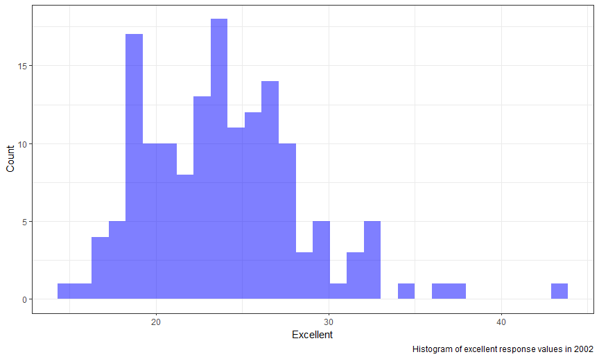

Data Science I: Homework 2
================
Nick Williams

Problem 1
---------

#### Importing data

``` r
nyc_transit_data <- read_csv("./data/NYC_Transit_Subway_Entrance_And_Exit_Data.csv")
```

#### NYC transit cleaning

``` r
nyc_transit_data <- nyc_transit_data %>% 
  janitor::clean_names() %>% 
  select(line:entry, 
         vending, 
         ada) 

nyc_transit_data$entry <- ifelse(nyc_transit_data$entry == "YES", TRUE, FALSE)
```

The NYC transit dataset contains information about exits and entries for each subway station in NYC. Important information includes the subway line, the subway station, the trains that stop at the station, and whether the entrance or exit is ADA compliant. My approach to cleaning the data was first cleaning the names using `clean_names()` in the Janitor package. I then used a pipe to select the important columns. I recognized that line, station name, latitude/longitude, routes served, and entry already occur in order in the original dataset and only needed to represent these columns as a range. I then used the `ifelse()` function to convert the entry column to a logical variable. By using the pipe operator, I was able to do all tasks in only two code blocks. The dimensions of the dataset are 1868 rows by 19 columns. These data are not tidy. Tidy data is defined as being normalized to the 3rd normal form. This requires columns to only be variables and not pieces of information. As such, the route columns would need to be collapsed into a variable.

-   There are 465 distinct stations.
-   84 stations are ADA compliant.
-   0.0369 of station entrances / exits without vending allow entry

#### Tidying transit data

``` r
nyc_transit_data <- nyc_transit_data %>%
                      gather(key = route_number, value = route_name, route1:route11) %>%
                      separate(route_number,
                               into = c("delete", "route_number"),
                               sep = 5) %>%
                      select(-delete)
```

-   60 distinct stations serve the A train.
-   17 of these stations are ADA compliant.

Problem 2
---------

#### Importing Mr. Trash Wheel data

``` r
trash_wheel_data <- read_excel("./data/HealthyHarborWaterWheelTotals2017-9-26.xlsx", 
                               sheet = "Mr. Trash Wheel", 
                               range = cell_cols("A:N")) 
```

#### Tidying Mr. Trash Wheel

``` r
trash_wheel_data <- trash_wheel_data %>% 
                      janitor::clean_names() %>% 
                      filter(!is.na(dumpster), 
                             month != "Grand Total") %>% 
                      mutate(sports_balls = as.integer(sports_balls))
```

#### Importing and cleaning precipitation data

``` r
precip_16_data <-
  read_excel("./data/HealthyHarborWaterWheelTotals2017-9-26.xlsx", 
             sheet = "2016 Precipitation", 
             range = "A2:B14") %>%
  janitor::clean_names() %>%
  mutate(year = 2016)

precip_17_data <- 
  read_excel("./data/HealthyHarborWaterWheelTotals2017-9-26.xlsx", 
             sheet = "2017 Precipitation",
             range = "A2:B10") %>% 
  janitor::clean_names() %>% 
  mutate(year = 2017)
```

#### Combining precipitation data

``` r
precip_data <- precip_16_data %>% 
               bind_rows(precip_17_data) %>%
               mutate(month = month.name[month])
```

The dataset `trash_wheel_data` has 215 observations and contains dumpster specific trash content information for the Mr. Trash Wheel in Baltimore from 2014 to 2017. The median number of sports balls in a dumpster in 2017 was 8. The dataset `precip_data` has 20 observations and contains information on the amount of precipitation (in inches) during 2016 and 2017 by month in Baltimore. In 2017, the total precipitation based on available data was 29.93 inches.

Problem 3
---------

#### Importing and cleaning data

``` r
brfss_data <- p8105.datasets::brfss_smart2010 %>% 
                janitor::clean_names() %>% 
                rename(state = locationabbr,
                       county = locationdesc) %>% 
                filter(topic == "Overall Health") %>% 
                select(-(class:question), 
                       -sample_size, 
                       -(confidence_limit_low:geo_location))

brfss_data <- brfss_data %>%
  spread(key = response, value = data_value) %>% 
  janitor::clean_names() %>%
  mutate(prop_very_good_excel =  
           (excellent + very_good) / (excellent + fair + good + poor + very_good))
```

#### Answers to questions

``` r
max_record <- count(brfss_data, state) %>%
  filter(n == max(n))
```

-   There are 404 distinct locations in the dataset. Every state, and the District of Columbia are represented. The state with the most observations is NJ with 146 observations.

-   In 2002, the median excellent response value was 23.6.

#### Plots

``` r
brfss_data %>% 
  filter(year == "2002") %>% 
  ggplot(aes(x = excellent)) + 
  geom_histogram(fill = "blue", alpha = 0.5) + 
  labs(x = "Excellent", 
       y = "Count", 
       title = "Histogram of excellent response values in 2002") + 
  theme_bw()
```



``` r
brfss_data %>% 
  filter(county %in% c("NY - New York County", "NY - Queens County")) %>% 
  mutate(prop_excellent = excellent / (excellent + fair + good + poor + very_good)) %>% 
  ggplot(aes(x = year, y = prop_excellent, color = county)) + 
  geom_point(size = 4) + 
  labs(x = "Year", 
       y = "Proportion excellent", 
       title = "Excellent response in New York and Queens County, 2002-2010") + 
  theme_bw()
```


